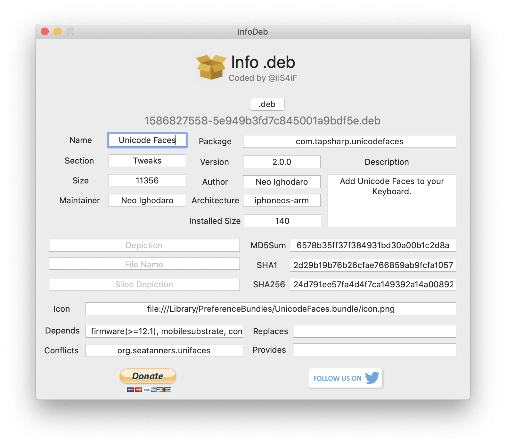

# InfoDeb
macOS app for show package info a deb!

### Features

* Show deb package info 
- [ ]  Name
   - [ ]  PackageName
   - [ ]  Package
   - [ ]  Section
   - [ ]  Version
   - [ ]  PackageAuthor
   - [ ]  Description
   - [ ]  PackageSize
   - [ ]  InstalledSize
   - [ ]  PackageMaintainer
   - [ ]  PackageArchitecture
   - [ ]  PackageIcon
   - [ ]  PackageFileName
   - [ ]  PackageSileoDepiction
   - [ ]  PackageDepiction
   - [ ]  md5
   - [ ]  sha1
   - [ ]  sha256
   - [ ]  Depends
   - [ ]  Conflicts
   - [ ]  Replaces
   - [ ]  Provides

* Encrypt deb file to 
- [ ]  md5
- [ ]  sha1
- [ ]  sha256

### How-to-use

InfoDeb
----------

  

* choose your deb file and will show deb info without extract!

Support me
------------

  

### License

     GNU GENERAL PUBLIC LICENSE
                          Version 3, 29 June 2007

    Copyright (C) 2007 Free Software Foundation, Inc. <https://fsf.org/>
    Everyone is permitted to copy and distribute verbatim copies
    of this license document, but changing it is not allowed.
